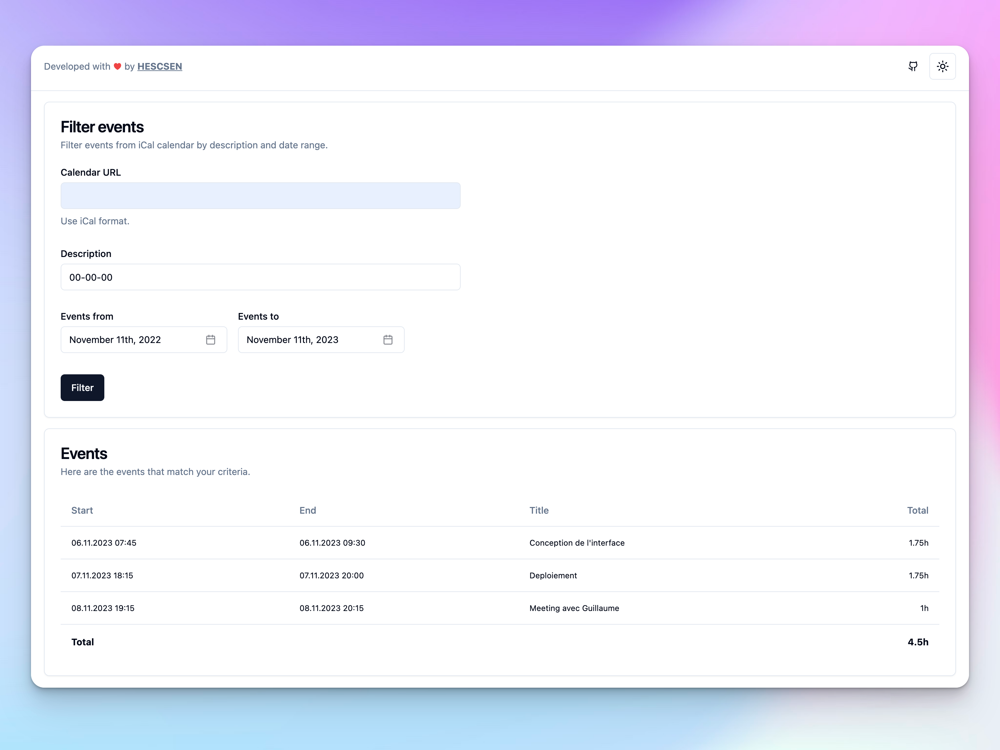

# Calendar Tracking

Calendar Tracking is a simple web application that allows users to track events.

You can find the deployed project at [calendar-tracking.hescsen.com](https://calendar-tracking.hescsen.com/).